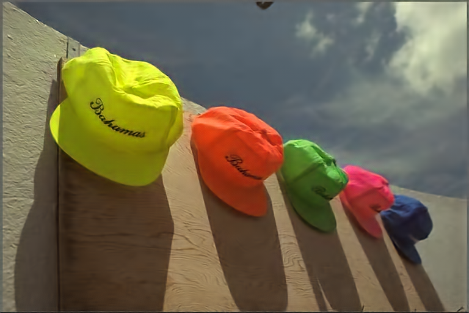
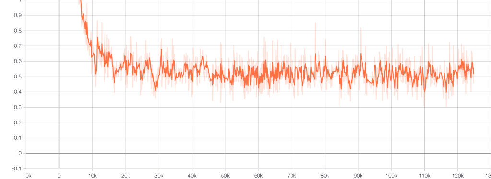
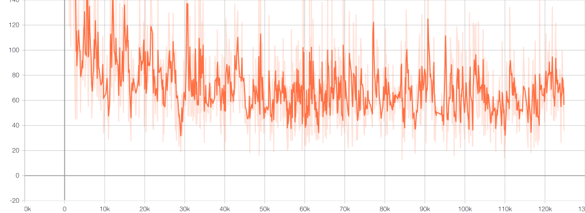
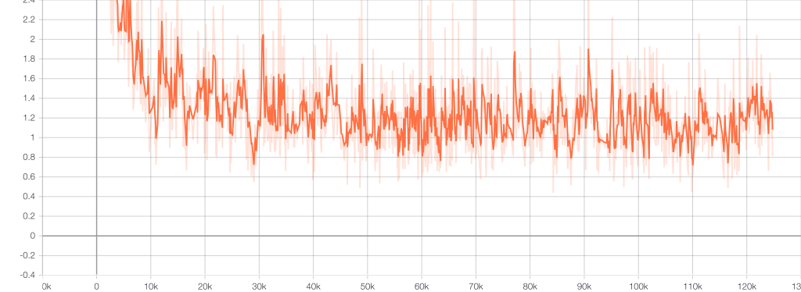
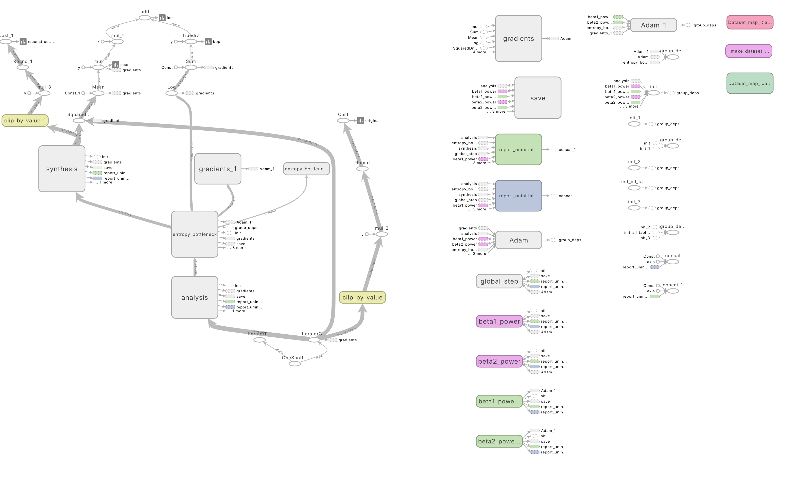

# EIC(Balle 2017)

#### Experiments done in January 2019

The repo is a re-implementation of the model published
in:

> "End-to-end optimized image compression"<br />
> J. Ballé, V. Laparra, E. P. Simoncelli<br />
> https://arxiv.org/abs/1611.01704

#### Code for reproducing the results are modified from Tensorflow Compression (tensorflow 1.13 compatible commit)

##### This directory contains Tensorflow Compression code modified to use range coding ops in the tensorflow.contrib.coder.python.ops in tensorflow 1.13

##### Do not use with original Tensorflow Compression as it has fast custom kernels for range coding.

##### This was done to avoid compilation issues.

##### Please refer to README from Tensorflow > 2.0 compatible Tensorflow Compression (https://github.com/tensorflow/compression) repo for better code for reproducing these results.

##### This repo is a public backup of a hobby project.

### CLIC Dataset

#### For script options
```bash
$ python eeicballe17.py -h
```

#### Training
```bash
$ python eeicballe17.py -v --train_glob="./datasets/CLIC/professional/train/*.png" --checkpoint_dir=./models/balle17CLIC train
```

#### Compressing and Decompressing single image using trained model
- Compress using model trained on CLIC 2019
```bash
$ python eeicballe17.py --verbose --checkpoint_dir=./models/balle17CLIC compress ./tests/groundtruth/kodak/kodim01.png ./tests/reconCLIC/epoch30684/kodim01.tfic
```
- Compress using model trained on BSDS500
```bash
$ python eeicballe17.py --verbose --checkpoint_dir=./models/balle17BSDS500 compress ./tests/groundtruth/kodak/kodim01.png ./tests/reconBSDS500/kodim01_bsds.tfic
```

- Decompress using model trained on CLIC 2019
```bash
$ python eeicballe17.py --verbose --checkpoint_dir=./models/balle17CLIC decompress ./tests/reconCLIC/epoch30684/kodim01.tfic ./tests/reconCLIC/epoch30684/kodim01_recon.png
```
- Decompress using model trained on BSDS500
```bash
$ python eeicballe17.py --verbose --checkpoint_dir=./models/balle17BSDS500 decompress ./tests/reconBSDS500/kodim01_bsds.tfic ./tests/reconBSDS500/kodim01_recon.png
```

## Results on CLIC2019 dataset

## Example

Original | EIC
:-------------------------:|:-------------------------:
|  |  |

```python
Original: 491.1 kB
EIC:  Compressed File size: 15.1 kB
      Mean squared error: 29.7069
      PSNR (dB): 33.40
      Multiscale SSIM: 0.9706
      Multiscale SSIM (dB): 15.32
      Information content in bpp: 0.3120
      Actual bits per pixel: 0.3148
```

The image shown is an out-of-sample instance from the Kodak dataset. The EIC image is obtained by reconstruction via a learned model on CLIC-2019.

Note that the learned model was not adapted in any way for evaluation on this image.

#### bpp (bits-per-pixel)

<div align="left">
  
</div>

#### mse (mean-squared-error)

<div align="left">
  
</div>

#### loss (mse + entropy coding auxiliary loss)

<div align="left">
  
</div>

#### probabilty mass function plot of entropy coder

<div align="left">
  
</div>


#### tensorboard model graph

<div align="left">
  
</div>

## Citation

> "End-to-end optimized image compression"<br />
> J. Ballé, V. Laparra, E. P. Simoncelli<br />
> https://arxiv.org/abs/1611.01704

> "Efficient nonlinear transforms for lossy image compression"<br />
> J. Ballé<br />
> https://arxiv.org/abs/1802.00847

If you use this library for research purposes, please cite:
```
@software{tfc_github,
  author = "Ballé, Johannes and Hwang, Sung Jin and Johnston, Nick",
  title = "{T}ensor{F}low {C}ompression: Learned Data Compression",
  url = "http://github.com/tensorflow/compression",
  version = "1.2b1 (beta)",
  year = "2018",
}
```
In the above BibTeX entry, names are top contributors sorted by number of
commits. Please adjust version number and year according to the version that was
actually used.
